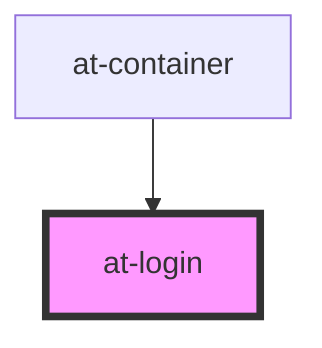

# at-login

<!-- Auto Generated Below -->

## Events

| Event        | Description | Type               |
| ------------ | ----------- | ------------------ |
| `loginEvent` |             | `CustomEvent<any>` |
| `register`   |             | `CustomEvent<any>` |

## Dependencies

### Used by

 - [at-container](../container)

### Graph

----------------------------------------------

*Built with [StencilJS](https://stenciljs.com/)*
