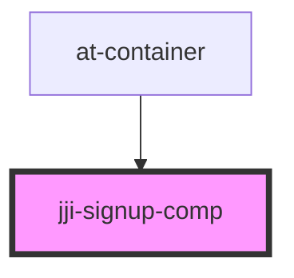

# jji-signup-comp

<!-- Auto Generated Below -->

## Properties

| Property | Attribute | Description | Type      | Default     |
| -------- | --------- | ----------- | --------- | ----------- |
| `opened` | `opened`  |             | `boolean` | `true`      |
| `titl`   | `titl`    |             | `string`  | `undefined` |

## Events

| Event               | Description | Type                                                                                           |
| ------------------- | ----------- | ---------------------------------------------------------------------------------------------- |
| `formDataSubmitted` |             | `CustomEvent<{ username: string; email: string; password: string; confirmPassword: string; }>` |
| `toLogin`           |             | `CustomEvent<any>`                                                                             |

## Methods

### `openSignUpComp() => Promise<void>`

#### Returns

Type: `Promise<void>`

## Dependencies

### Used by

 - [at-container](../container)

### Graph

----------------------------------------------

*Built with [StencilJS](https://stenciljs.com/)*
